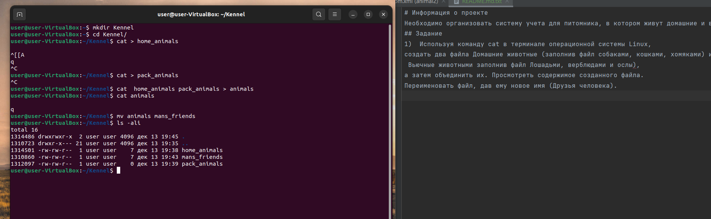

# _Информация о проекте_
Необходимо организовать систему учета для питомника, в котором живут домашние и вьючные животные.
## _Задание_
1.  Используя команду cat в терминале операционной системы Linux, 
создать два файла Домашние животные (заполнив файл собаками, кошками, хомяками) и Вьючные животными заполнив файл Лошадьми, верблюдами и ослы),
а затем объединить их. Просмотреть содержимое созданного файла. Переименовать файл, дав ему новое имя (Друзья человека).

2. Создать каталог, переместить файл туда.
