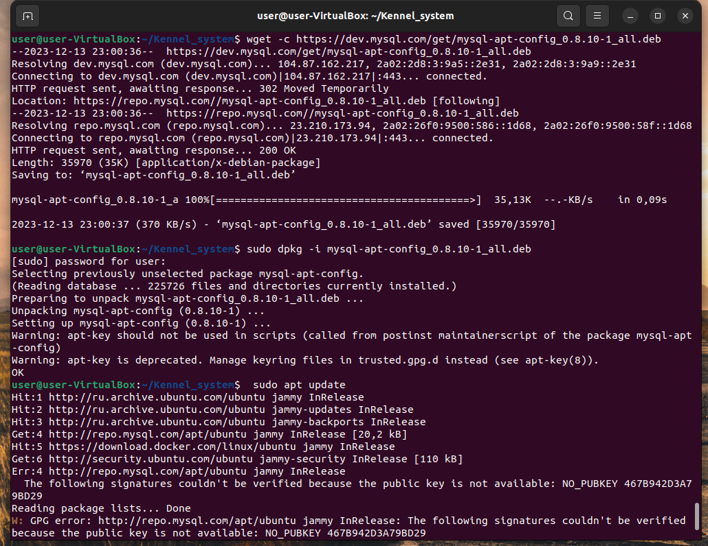
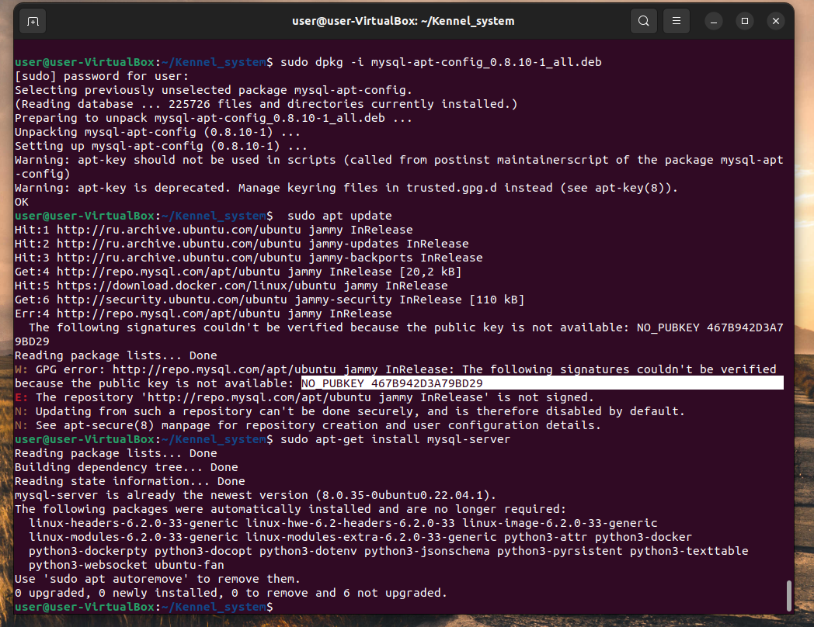
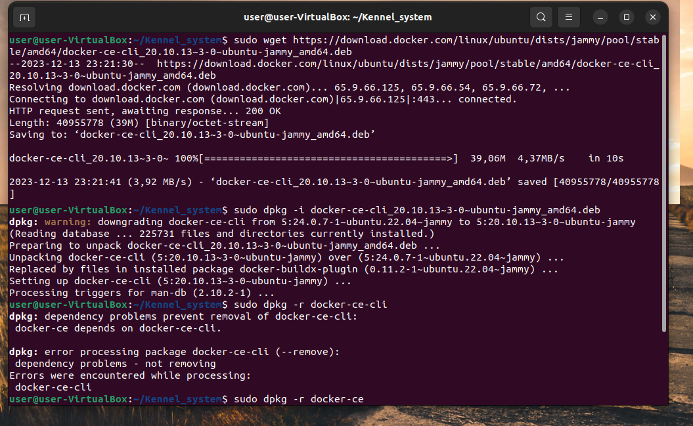
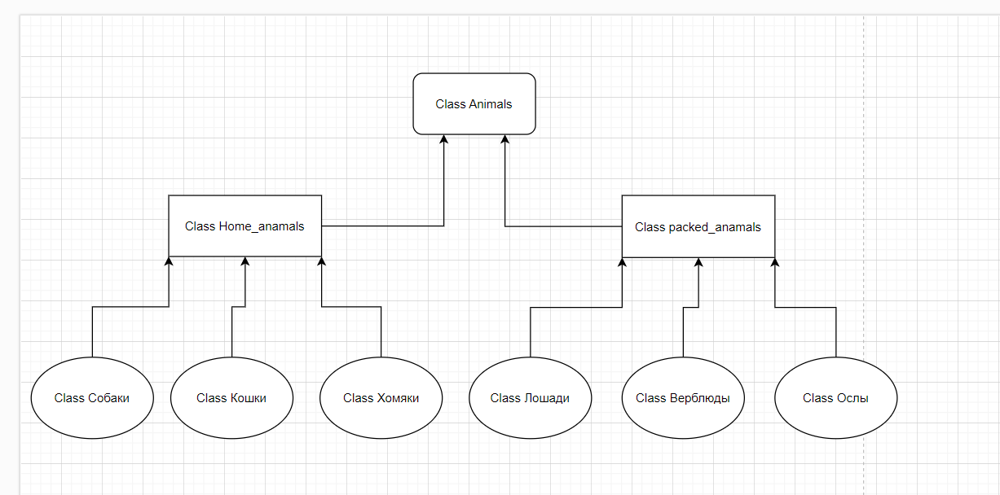

# _Информация о проекте_
Необходимо организовать систему учета для питомника, в котором живут домашние и вьючные животные.
## _Задание_
1.  Используя команду cat в терминале операционной системы Linux, 
создать два файла Домашние животные (заполнив файл собаками, кошками, хомяками) и Вьючные животными заполнив файл Лошадьми, верблюдами и ослы),
а затем объединить их. Просмотреть содержимое созданного файла. Переименовать файл, дав ему новое имя (Друзья человека).


2. Создать каталог, переместить файл туда.


3. Подключить дополнительный репозиторий MySQL. Установите любой пакет из этого репозитория.
   

   

   
4. Установите и удалите deb-пакет с помощью dpkg.

   

5. Выложить [историю команды](HistoryCommandsUbuntuTerminal.md) в терминале Ubuntu
   
   
6. Нарисовать [диаграмму](animal2/diogramma.drawio) , в которой есть класс родительский класс, домашние и вьючные животные, в составе которых в случае домашних животных войдут классы: собаки, кошки, хомяки, а в классе вьючные животные войдут: Лошади, верблюды и ослы).


7. В подключенном MySQL репозитории создать ресурсы данных «Друзья человека»
```sql
CREATE DATABASE Human_friends;
```

8. Создать таблицы с иерархией из диаграммы в БД
```sql
USE Human_friends;
CREATE TABLE animal_classes
(
	Id INT AUTO_INCREMENT PRIMARY KEY, 
	Class_name VARCHAR(20)
);

INSERT INTO animal_classes (Class_name)
VALUES ('вьючные'),
('домашние');  


CREATE TABLE packed_animals
(
	  Id INT AUTO_INCREMENT PRIMARY KEY,
    Genus_name VARCHAR (20),
    Class_id INT,
    FOREIGN KEY (Class_id) REFERENCES animal_classes (Id) ON DELETE CASCADE ON UPDATE CASCADE
);

INSERT INTO packed_animals (Genus_name, Class_id)
VALUES ('Лошади', 1),
('Ослы', 1),  
('Верблюды', 1); 
    
CREATE TABLE home_animals
(
	  Id INT AUTO_INCREMENT PRIMARY KEY,
    Genus_name VARCHAR (20),
    Class_id INT,
    FOREIGN KEY (Class_id) REFERENCES animal_classes (Id) ON DELETE CASCADE ON UPDATE CASCADE
);

INSERT INTO home_animals (Genus_name, Class_id)
VALUES ('Кошки', 2),
('Собаки', 2),  
('Хомяки', 2); 

CREATE TABLE cats 
(       
    Id INT AUTO_INCREMENT PRIMARY KEY, 
    Name VARCHAR(20), 
    Birthday DATE,
    Commands VARCHAR(50),
    Genus_id int,
    Foreign KEY (Genus_id) REFERENCES home_animals (Id) ON DELETE CASCADE ON UPDATE CASCADE
);
```
   


