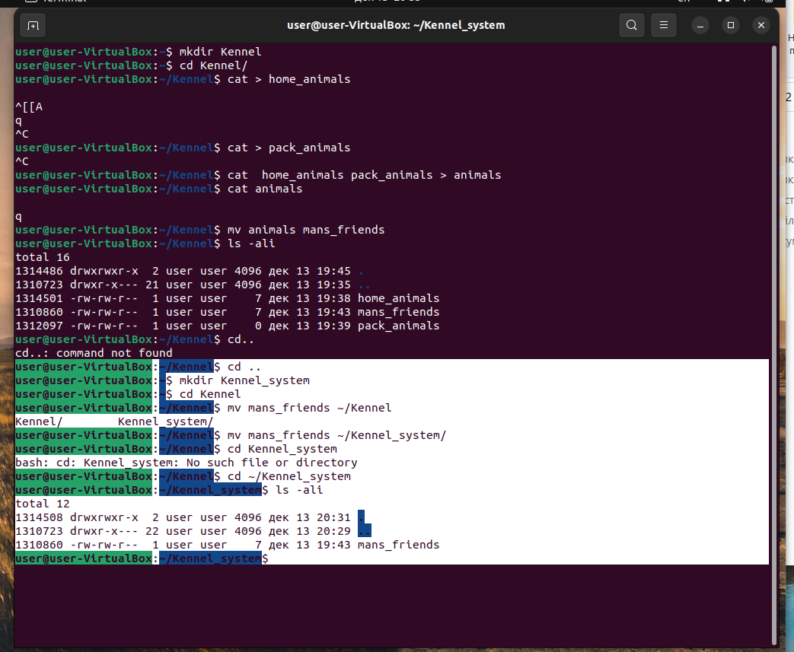

# _Информация о проекте_
Необходимо организовать систему учета для питомника, в котором живут домашние и вьючные животные.
## _Задание_
1.  Используя команду cat в терминале операционной системы Linux, 
создать два файла Домашние животные (заполнив файл собаками, кошками, хомяками) и Вьючные животными заполнив файл Лошадьми, верблюдами и ослы),
а затем объединить их. Просмотреть содержимое созданного файла. Переименовать файл, дав ему новое имя (Друзья человека).

2. Создать каталог, переместить файл туда.

3. Подключить дополнительный репозиторий MySQL. Установите любой пакет из этого репозитория.
   

   

   
4. Установите и удалите deb-пакет с помощью dpkg.

   

5. Выложить [историю команды](HistoryCommandsUbuntuTerminal.md) в терминале Ubuntu
   
   
6. Нарисовать [диаграмму](animal2/diogramma.drawio) , в которой есть класс родительский класс, домашние и вьючные животные, в составе которых в случае домашних животных войдут классы: собаки, кошки, хомяки, а в классе вьючные животные войдут: Лошади, верблюды и ослы).

7. В подключенном MySQL репозитории создать ресурсы данных «Друзья человека»
   CREATE DATABASE Human_friends;

   

